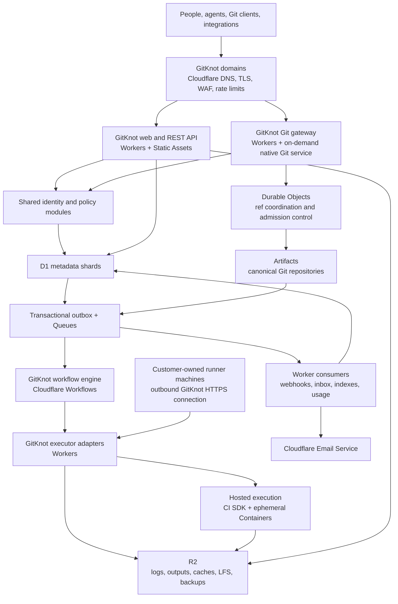
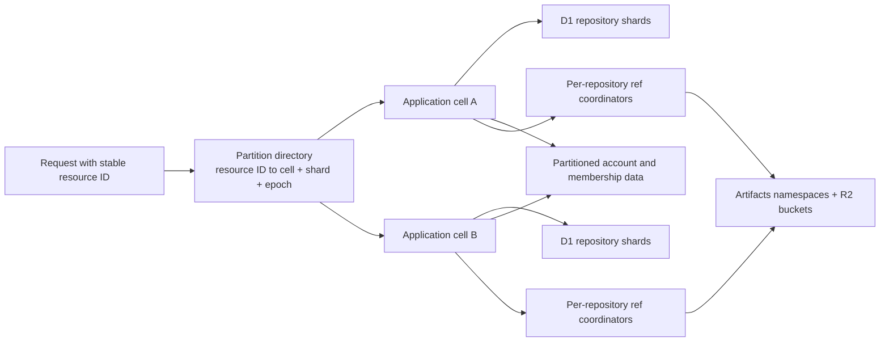
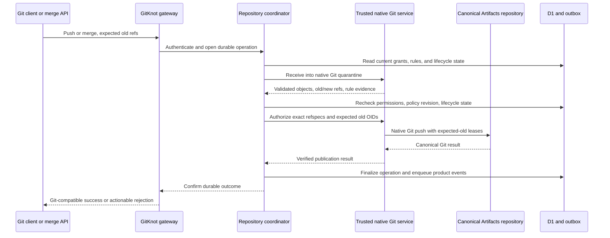
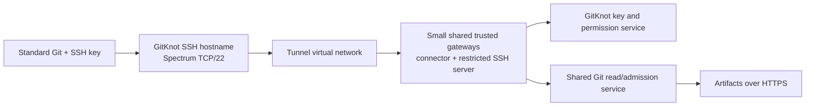
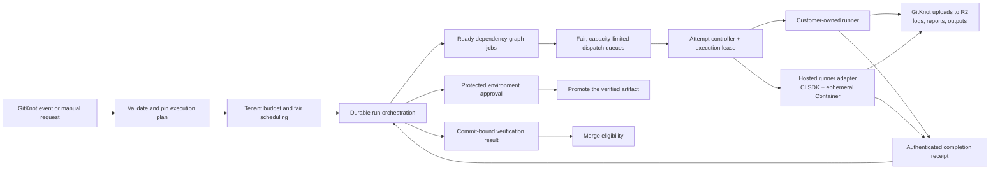

# GitKnot: product and architecture proposal

**Status:** Proposed direction · **Research date:** 4 October 2026

**Audience:** Internal product and engineering team

## 1. Recommendation

Build GitKnot as an independent, API-first software collaboration platform, with Cloudflare as its infrastructure provider. GitKnot owns the accounts, repository model, permissions, collaboration experience, workflow system, pricing, and operational responsibility.

Use **Artifacts for durable Git storage; Workers for the application and API; D1 for relational metadata; Durable Objects for narrowly scoped coordination; Queues for asynchronous delivery; Workflows for durable orchestration; `@cloudflare/ci` with ephemeral Containers for hosted execution; and R2 for large objects.** Meter and reserve execution costs before accepting work.

Support general-purpose shell CI through **GitKnot-hosted SDK-backed runners and customer-owned runners**. GitKnot's hosted application and managed infrastructure stay on Cloudflare; customer-owned runner machines are the explicitly supported external execution boundary. The cost strategy is right-sized, short-lived execution, with hard limits and verified cleanup.

The opportunity in the [Cloudflare article][article] is the programmable Git foundation: on-demand workspaces, repository events, and infrastructure that can support many concurrent contributors. GitKnot should turn those primitives into a coherent product for people and agents working together, with clear ownership, explainable rules, reproducible verification, and controlled costs.

GitKnot's control plane implements authorization, protected Git publication, workflow policy, secret handling, billing, and recovery on top of Cloudflare's primitives. These mechanisms are planned product work. Deliver working **HTTPS Git first**, then add native SSH. Correctness and enforceable cost controls are acceptance criteria for the implementation.

**Service-limit planning:** the project expects the Artifacts repository-size limit to be lifted within the next couple of weeks. Keep GitKnot's limits configurable and recheck both repository and blob ceilings at rollout. The published limits are a current configuration reference; the anticipated increase is project planning input. [Artifacts limits][artifacts-limits]

### Product boundary

Users should only need to understand GitKnot:

| Users interact with | GitKnot owns behind the scenes |
| --- | --- |
| GitKnot accounts, organizations, teams, and repositories | Infrastructure accounts, resource provisioning, tenancy, and placement |
| GitKnot web UI, REST API, CLI, and Git remotes | Workers, bindings, internal service calls, and storage adapters |
| GitKnot workflows, runtime limits, environments, and logs | Scheduling, isolated task execution, retries, and cleanup |
| GitKnot credentials, deploy keys, secrets, and variables | Authentication, policy enforcement, encryption, and credential exchange |
| GitKnot usage, budgets, invoices, and support | Metering, infrastructure costs, capacity planning, and incident response |

All public identifiers, errors, documentation, download URLs, and workflow examples use GitKnot concepts. A user never needs a provider account, provider token, infrastructure dashboard, or infrastructure-specific configuration. Provider failures become actionable GitKnot errors with a GitKnot request ID; internal diagnostics retain the original details.

For example, `git clone https://git.gitknot.example/acme/catalog.git` and `GET https://api.gitknot.example/v1/repos/r_catalog` remain stable when GitKnot moves the repository between storage partitions. Domains and public API syntax in this document are illustrative.

### Lessons informing the product

Research into public maintainer experiences, user feedback, and documented platform limitations informs these requirements. The aim is predictable behavior, especially when many contributors and automations operate concurrently.

| Failure mode | GitKnot's product decision |
| --- | --- |
| Trial-and-error CI and ambiguous required checks | Validate before execution, freeze the run manifest, and explain every verification obligation, including why it is inapplicable or blocked. |
| Permission gaps that encourage overpowered credentials | Provide the same capability model for personal and organization repositories, with scoped service identities and complete API coverage. |
| Surprise charges and overlapping limits | Separate alerts from enforceable caps; reserve concurrent spending; disclose the payer, seat effects, storage accrual, and maximum run cost. |
| Notification volume displacing useful review | Keep outstanding decisions separate from activity, group repeated automation updates, and preserve tasks until they are resolved. |
| Partial search mistaken for a complete answer | Show revision, indexed coverage, exclusions, truncation, and pagination; support an asynchronous complete scan. |
| Review context lost during concurrent edits/restacks | Preserve patch history, anchor comments to revisions, and show exactly what changed since a review. |
| Unclear visibility and link-sharing behavior | Define the audience explicitly and enforce it across every representation of repository content. |
| Lossy document editing and incomplete exports | Preserve canonical Markdown and provide versioned, restorable archives of code and collaboration data. |
| Missed events and duplicate side effects | Use durable publication, bounded automatic retries, replay, revision checks, and idempotent operations. |

Supporting rationale includes DORA's guidance on [continuous integration][dora-ci] and [small batches][dora-batches], Edward Yang's [firsthand account of review load][review-load], the FinOps Foundation's [budgeting guidance][finops], and Marijn Haverbeke's [project migration account][migration-account]. These inform affirmative GitKnot requirements rather than a feature-by-feature imitation.

## 2. Architecture and required infrastructure



These boxes describe responsibilities. Start with a modular TypeScript application and a small number of independently deployed Workers: web/API, Git ingress, background orchestration/consumers, and a private secrets broker. Isolate the execution pool from the trusted application. Feature modules such as issues and discussions can share the application deployment.

### Infrastructure inventory

| Cloudflare component | Specific responsibility | Important design choice |
| --- | --- | --- |
| **Workers Paid + Static Assets** | Web application, REST API, Git ingress, private services, event consumers | Stream large responses; use service bindings for private Worker-to-Worker calls. |
| **Artifacts** | Git objects, refs, repository creation, forks, imports, repository events | GitKnot holds infrastructure credentials and mediates every customer operation. Use opaque repository IDs internally. |
| **D1** | Users, memberships, repository metadata, issues, reviews, policy, workflow records, billing ledger | Partition relational data; keep large binary content in R2. |
| **SQLite-backed Durable Objects** | Serialize ref mutations; maintain execution leases, admission decisions, and bounded live subscriptions | Choose objects by resource or scheduling partition. Avoid a platform-wide coordinator. |
| **Queues + dead-letter queues** | CI dispatch, webhook delivery, notification delivery, indexing, metering | Consumers are idempotent; retain a recoverable source event outside the queue. |
| **Workflows** | Durable CI coordination, approvals, transfer/import/export processes, retryable maintenance | GitKnot defines the workflow language and semantics; this service persists orchestration. |
| **Containers + Sandbox/CI SDK** | Ephemeral hosted CI jobs and a separate trusted native-Git execution service | Small, measured runtime profiles; scoped credentials; timeouts; explicit teardown; separate trusted and untrusted execution pools. |
| **R2** | CI outputs, chunked logs, caches, LFS objects, uploads, avatars, exports, backups | Private buckets, authenticated GitKnot download endpoints, retention policies, content checksums. |
| **Workers secrets / Secrets Store** | A small set of platform credentials and key-encryption keys | Tenant secrets are encrypted application data; the current store limit cannot accommodate one provider secret per customer secret. |
| **Email Service** | Verification, invitations, review requests, digests, delivery-status handling | GitKnot sending domain and templates; provision sending capacity before onboarding users. |
| **DNS, TLS, WAF, rate limiting** | GitKnot domains, ingress protection, abuse controls | API and Git clients receive protocol-appropriate responses rather than interactive browser challenges. |
| **Later: Spectrum + Tunnel virtual networks** | Native SSH Git ingress after HTTPS is working | Evaluate a small shared gateway, redundancy, entitlements, and bandwidth costs during the SSH phase. |
| **Workers Observability, Analytics Engine, Logpush to R2** | Internal logs, traces, latency/error metrics, operational investigations | Financial accounting comes from the durable ledger; sampled telemetry supports operations. |

Provision production and staging separately. Within production, isolate trusted application resources from untrusted execution, preferably in separate provider accounts. Cross-account communication uses narrowly scoped, authenticated internal endpoints; same-account private Workers use service bindings.

Customer-owned runners are installed with GitKnot tooling and communicate with GitKnot APIs; they need no Cloudflare account or SDK. Workers handle the control plane; shell scripts and native toolchains execute on hosted or customer-owned runners. [Workers Builds][workers-builds] is useful for bootstrapping deployment of GitKnot's own services, while the CI SDK supplies the more flexible hosted-execution foundation.

**SDK boundary:** reuse [`@cloudflare/ci`][custom-ci] for runner/cache/pipeline machinery behind a narrow GitKnot executor adapter. GitKnot supplies the workflow format, authorization, scheduling fairness, public run history, billing, and customer-runner backend. Implement and test these integration mechanisms as part of the control plane.

## 3. Data layout, consistency, and scaling

### Clear authorities

| Data | Authority |
| --- | --- |
| Git objects and accepted canonical refs | Artifacts |
| Account, collaboration, policy, lifecycle, and billing records | D1 |
| Active ref-mutation journal and execution/admission leases | The responsible Durable Object |
| Large binary content and completed log chunks | R2 |
| Feed/search projections and operational charts | Rebuildable views of the authorities above |

Use immutable `user_id`, `org_id`, `repo_id`, and `run_id` values. Names and ownership can change without changing identity. Every repository-scoped row, object key, credential, event, and permission check carries its owning resource ID.

### Partitioning



A **cell** is a bounded deployment with a manageable set of database bindings, queues, and storage namespaces. Begin with a small number of shards; create additional cells as capacity requires. The directory is logical and partitionable, with cacheable routing entries. Each destination checks the routing epoch so an old entry cannot authorize writes after a move.

- Partition repository data by `repo_id`, keeping ordinary repository transactions together. Large organizations span repository shards. An exceptionally large repository can split thread/history/run partitions while retaining a small current repository/policy shard.
- Partition identity, memberships, inboxes, and billing by their owning account. Move hot tenants to dedicated shards; split high-volume membership and history partitions when measured capacity requires it.
- D1 has a **10 GB hard limit per database**, and each primary executes queries serially. Plan shard movement at roughly 60–70% of storage capacity or sooner if latency/throughput warrants it. Read replicas improve reads, not primary write capacity. [D1 limits][d1-limits]
- Keep the database routing layer private. A Worker has a finite binding budget; provision cell-local bindings instead of attaching every database to one script.
- Partition Artifacts namespaces as well: the published control-plane rate is 2,000 requests per ten seconds per namespace; Git requests have the same rate limit per repository. Reuse server-side read credentials where safe instead of minting one per HTTP request. Read caches can reduce origin traffic; namespace sharding does not increase a single repository's write or size limit. [Artifacts limits][artifacts-limits]
- Use indexed, cursor-paginated queries. Archive old workflow attempts, delivery bodies, and audit payloads to R2 with queryable summaries in D1.
- Each Durable Object is also single-threaded, with a documented soft limit of about **1,000 requests/second**. Reserve repository coordinators for ref changes and lifecycle barriers; comments and feed reads do not traverse them. [Object limits][do-limits]
- Large public audiences read a repository activity stream on demand. Fan out direct mentions and review requests; avoid copying every event to every follower.
- Keep D1 full-text search in separate, rebuildable projection databases. Native D1 export does not support databases containing virtual tables and blocks other database requests while running; schedule and measure backup impact. [Export behavior][d1-export]

### Consistency and event delivery

Permission checks, credential revocation, visibility changes, and mutation preconditions use current authoritative state. D1 Sessions with `first-primary` provide a current starting point; bookmarks provide read-your-writes for subsequent UI requests. A bookmark alone does not prove that a later revocation has been observed. Cache routing and immutable content separately from authorization. [Read replication][d1-replication]

For very hot read paths, short-lived authorization leases can reduce primary lookups, but only with an explicit revocation barrier: stop issuing grants and drain/invalidate existing grants before reporting the change complete. Establish that bound through testing; never use an eventually consistent cache entry as an indefinite permission grant.

Commit metadata changes and an **outbox event in the same D1 batch transaction**. A dispatcher publishes committed events to Queues; a scheduled sweeper retries unpublished rows. Consumers record processed event IDs alongside their effects. Duplicate delivery is normal, and queue order is not a business invariant. [D1 transactions][d1-api] · [Queue delivery][queue-delivery]

Git storage and D1 cannot share a transaction. The ref coordinator records an operation before publication, verifies the accepted refs, and then finalizes metadata and events. Recovery inspects the actual refs and reconciles uncertain outcomes. Artifacts events provide an additional reconciliation signal; GitKnot emits its own normalized, versioned events for customer integrations.

Record the authenticated actor in GitKnot's operation journal. Commit author fields are not authentication evidence, and the documented Artifacts push envelope does not identify the authenticated pusher or a stable event occurrence ID. Verify subscription scope and coverage in the prototype; correctness must survive missed or duplicate upstream events. [Artifacts events][artifacts-events]

Across shards, use explicit operations such as `transfer_pending`, `moving`, and `completed`, with resumable Workflows. A migration copies data, verifies it, briefly fences writes, applies the final changes, switches the routing epoch, and retains the previous copy for recovery.

## 4. Repository model and Git support

### Repository structure and visibility

A repository has exactly one owner: a user or an organization. Organizations contain teams, members, service identities, policies, and a billing account. Outside collaborators receive explicit repository access without implicitly becoming organization members.

| Visibility | Read access | Discovery |
| --- | --- | --- |
| **Public** | Anyone | Public profiles, search, feeds, and discovery |
| **Private** | Explicitly authorized principals | Authorized viewers only |
| **Internal** | Members of the owning organization, subject to organization restrictions; explicit additional grants where permitted | Within that organization; never shared with unrelated tenants |
| **Unlisted** | Anyone who has the URL | Excluded from public directories, search, recommendation feeds, and public profile listings |

Unlisted is a discoverability setting, not confidential sharing. A private repository can instead issue a revocable, expiring viewer grant. Internal visibility is available to organization-owned repositories.

The same rules apply to raw files, Git reads, archives, LFS, diffs, issue attachments, workflow logs, releases, search snippets, notifications, and forks. Authorization occurs before a cached response is served. An object hash alone never grants access: verify its association with the authorized repository, including fork and LFS objects. Visibility changes remove discovery projections and invalidate accessible caches. Previously downloaded public content cannot be recalled.

### Git transport and publication

Support ordinary Git clone, fetch, push, branches, tags, history, and standard object IDs through GitKnot remotes. Artifacts documents smart HTTPS with v1/v2 fetch and v1 push; some optional capabilities are unsupported, so publish a tested compatibility matrix covering shallow fetch, partial-clone behavior, tags, notes, submodules, and large pushes. Git browsing, archives, diffs, comparisons, and merge previews use the same authorization layer. [Git protocol][artifacts-protocol]

Implement a **GitKnot LFS batch/object service backed by R2**, including quotas, checksums, and repository ownership checks. Artifacts does not currently document an LFS service. Native Git jobs handle authenticated private imports and complete exports; the built-in import API documents public HTTPS sources. Transfer LFS and collaboration data separately. [Import support][artifacts-imports]

**All canonical writes go through GitKnot's controlled publication path.** Customers and CI jobs never receive a general-purpose storage write credential for the canonical repository.

Artifacts tokens currently grant repository-wide `read` or `write`; its published binding/API does not provide branch-scoped credentials, custom receive hooks, or a documented conditional `updateRef`/merge operation. Request explicit scopes rather than relying on token defaults. GitKnot supplies the policy and native-Git admission layer. [Binding capabilities][artifacts-binding] · [Token scopes][artifacts-protocol]



The trusted service uses a disposable or refreshed bare repository, native Git quarantine, and `pre-receive` validation. A `proc-receive` adapter owns promotion and returns success only after canonical publication succeeds. These hooks run in GitKnot's Git process. Staging is inaccessible to ordinary readers; working disks are replaceable caches, while Artifacts holds durable objects and refs. [Receive quarantine][git-receive] · [Receive hooks][git-hooks]

Use native Git for full-graph ancestry, raw-object signature verification, diffs, and merge construction. The binding's first-parent `log()` and normalized commit metadata are insufficient for those complete checks. Promote exact approved refspecs using explicit `--force-with-lease=<ref>:<expected>` values after separately enforcing ancestry policy. HTTP 200 alone is insufficient: inspect Git report-status and resulting refs. [Git push semantics][git-push]

Run this trusted service separately from customer CI, with no repository-provided hooks or scripts. Start compute only for active Git work; bound any warm-cache window by measured savings. Persist merge candidates in an access-controlled repository/workspace before CI, and release Git compute while checks or approvals are pending. Inspect all supplied objects when a storage-wide rule requires it, rather than assuming reachable-history checks cover surplus packed objects.

The implementation must check **all updated refs and newly reachable content**, including force pushes, deletes, tags, and multi-ref pushes. Inspect ancestry separately from freshness: expected-old ref values do not enforce fast-forward policy. A post-push event cannot reject an already accepted change. Checking the command header alone cannot validate file restrictions, signatures, or secret-scanning rules.

Conditional publication and an exclusive, durable operation must prevent a checked update from overwriting an intervening change. On timeouts, keep writes fenced and reconcile the old publisher's outcome before admitting a replacement; an expired local lease does not stop an already-sent storage request. Multi-ref atomicity, stale-publisher exclusion, and large-push behavior must be proven against the storage service's protocol capabilities.

### Lifecycle

- **Create/import/fork:** apply organization defaults and visibility; provision storage asynchronously through a visible operation resource. Forks of restricted repositories retain access boundaries. Task workspaces are private by default.
- **Rename/transfer:** preserve repository ID, issue links, reviews, and history. The receiving owner accepts the transfer; recompute access, billing ownership, policy, and discovery. Revoke or reauthorize credentials and integrations before writes reopen. An internal repository transferring to a personal owner becomes private. Record historical usage against the owner at the time of consumption.
- **Archive:** make repository content and collaboration read-only; stop scheduled jobs and reject pushes. Preserve browsing, export, credential revocation, and billing visibility. Unarchive is a separately authorized operation.
- **Delete/restore:** revoke access immediately, provide a documented recovery window, then purge content and derived indexes according to retention. Cleanup must account for forks and retained review commits.

Implement rename, ownership, visibility, and archival in GitKnot's catalog/gateway using stable backend names. The current Artifacts API does not document those existing-repository mutations or a user-invokable restore operation. A recovery window therefore requires GitKnot retention/backups rather than an assumed backend undelete feature. [Artifacts API][artifacts-rest]

## 5. Permissions, branch rules, and credentials

### One permission system

Use **roles composed of explicit capabilities**, with resource scopes and a small, typed set of conditions. Principals include users, teams, application installations, automation identities, agents, and deploy keys.

Provide understandable starter roles—Owner, Administrator, Maintainer, Contributor, Reviewer, Reader, and Billing Manager—and allow custom roles for both personal and organization repositories. Separate capabilities such as `issues.triage`, `pull_requests.review`, `contents.push`, `rules.manage`, `workflows.run`, `runners.manage`, `environments.approve`, `secrets.manage`, `secrets.use`, `webhooks.manage`, and `billing.read`.

Effective access is the intersection of the principal's grants, its credential scope, and the organization policy ceiling. Explicit denials win. A content-write grant does not bypass branch rules. Billing access does not imply code access, and secret administration does not imply permission to reveal existing secret values.

Git content-read access covers repository history; branch/path conditions constrain writes. Keep distinct confidential audiences in distinct repositories rather than implying that a standard clone can enforce per-file confidentiality.

Enforce this policy in the UI's backend, REST API, Git transport, integrations, jobs, and download handlers. Publish an authorized **“why allowed / why denied”** view and a dry-run endpoint showing the matched rules and missing requirements. Preserve the last recoverable organization owner.

**Example:** A release operator can rerun verification and approve a production release for `acme/catalog`, but cannot alter source, change branch rules, manage credentials, or access another repository. A dependency agent can push only to `automation/dependencies/*`, open a PR, and read that PR's verification results.

### Rules are explainable and composable

Organization policy supplies mandatory constraints; repositories can strengthen them. Branch and tag patterns select where constraints apply. Validate conflicting rules at configuration time and show the effective policy before publishing an edit.

Proposed rule syntax:

```yaml
version: 1
target: refs/heads/main
updates: pull_request_only
reviews:
  minimum: 2
  disallow_author_approval: true
  required_owners:
    "database/**": [team/data]
verification:
  required: [verify.test, verify.build]
  revision: merge_candidate
history:
  allow_force_push: false
  allow_deletion: false
bypass:
  capability: rules.break_glass
  reason_required: true
  maximum_duration: 30m
```

Support required reviewers/path owners, unresolved-thread rules, required verified results, allowed merge strategies, signature requirements, branch/tag creation/deletion restrictions, linear-history preferences, file/path/size restrictions, and scoped push restrictions. Emergency bypass is explicit, time-bounded, and audited.

The merge queue builds and tests the **actual candidate commit** against the current target. Results bind to repository, candidate hash, workflow definition digest, policy revision, and trusted producer identity. If the target changes, revalidate/rebuild the candidate. A user-authored status with the same display name cannot satisfy a required result.

### Identity and deploy credentials

- GitKnot owns sign-up, verification, recovery, sessions, passkeys/MFA, and organization membership. Enterprise federation can use standard OIDC/SAML and SCIM through the same membership model.
- Personal tokens and application credentials support explicit repository/capability scopes, expiration, revocation, last-used visibility, and rotation. Prefer short-lived installation/job tokens for automation.
- HTTPS automation initially uses repository-scoped GitKnot credentials. Native SSH deploy keys later attach to the same machine-identity and permission model: read-only by default, with optional scoped writes, fingerprints, owners, expiry, last-used records, rotation, and revocation.

### Later: native SSH deploy keys

Once HTTPS clone, fetch, push, and policy enforcement are working, add the ordinary SSH experience: `git clone git@git.gitknot.example:acme/catalog.git`, authenticated by a repository-scoped key. Artifacts supplies HTTPS storage; GitKnot supplies the later SSH transport and reuses the existing authorization and publication services.



[Spectrum documents TCP/22 through a Tunnel virtual-network origin][spectrum-vnet]. During the SSH phase, prototype the fully Container-hosted connector/origin and test addressing, connector egress, keepalive, redundancy, restart/failover, stable host keys, and plan entitlements. Size a small shared gateway pool and budget its standing cost and Spectrum bandwidth separately.

Permit only authorized Git commands, with shell access and port forwarding disabled. SSH and HTTPS writes reach the same admission gate. Built-in Container SSH is operator access requiring a provider account; the customer endpoint is GitKnot-owned. Validate stock-client compatibility before adding SSH to supported transports. [Container SSH boundary][container-ssh]

## 6. Collaboration and agent coordination

| Capability | GitKnot behavior |
| --- | --- |
| **User profiles** | Avatar, bio, repositories, follows, contribution/activity views, and privacy controls. Private activity is visible only to authorized viewers. |
| **Feed and notifications** | Chronological, filterable activity; a separate actionable inbox for mentions, assignments, and review requests; per-thread/repository subscriptions, snooze, mute, digests, grouped bot activity, and notification explanations. Reading an event does not complete a task. |
| **Collaborators and teams** | Invitations with expiration, outside collaborators, team ownership, scoped roles, service identities, and access review. |
| **Issues** | Templates, labels, assignments, milestones, typed statuses, dependencies, linked changes, duplicate handling, saved filters, attachments, and event history. |
| **Pull requests** | Drafts, suggested changes, review threads, requested reviewers, patch-version comparisons, merge conflicts, dependencies between PRs, and merge-queue status. |
| **Discussions** | Categories, threaded responses, accepted answers, moderation, subscription controls, and conversion/linking to an issue while preserving context. |
| **Markdown** | Source and WYSIWYG modes over one canonical Markdown document; [CommonMark][commonmark] plus tables, task lists, mentions, autolinks, fenced code, and diagrams. Preserve unsupported blocks when switching modes. |
| **Search** | Shared web/API/CLI semantics, stable filters, saved views, visible indexing freshness, and explicit complete/partial coverage. Use partitioned D1 full-text indexes for collaboration data; bounded revision-scoped code scans use Workers, Artifacts reads, and R2 result chunks. |

Render Markdown and diagrams safely, with keyboard-accessible editing and previews. Serve attachments through authorized GitKnot routes. Keep Markdown source as the export format so rich-text editing cannot trap content in a proprietary document model.

Document edits in repositories create ordinary proposed changes through branch policy. Preserve drafts and rendered-passage comment anchors; concurrent saves use expected revisions. Code search can run asynchronously for large repositories or organization-wide maintenance, returning the scanned revisions, exclusions, and full paginated results. Reauthorize search/inbox references before rendering them and before sending email.

Review state belongs to a **patch version**. Preserve comments and unaffected approvals across harmless rebases; identify which changed files invalidate which reviews. Dependent PRs show their dependency graph, can be restacked, and make the resulting verification/review invalidation explicit.

### Concurrent work is a first-class workflow

A task links an issue, an accountable person, one or more contributors, a base revision, workspaces, and proposed changes. Agents are ordinary scoped principals with explicit attribution, budgets, and expiring credentials.

Example process:

1. A maintainer assigns an API migration task. Two agents receive private forks from the same base: one implements the API change and one explores compatibility tests.
2. Each declares intended areas of work. Lightweight task claims and expiring heartbeats surface overlapping work without locking the repository.
3. Agents publish draft PRs with structured summaries, evidence, and dependencies. GitKnot records the initiating task, actor, base commit, and resulting commits.
4. Reviewers compare the proposals, resolve overlaps, and approve the selected changes. The merge queue verifies their combined candidate.
5. The accepted change retains its task context and decision summary. Abandoned workspaces expire under a visible retention policy while referenced review commits remain available.

This supports large numbers of independent workspaces while keeping the final decision, accountability, and canonical repository understandable.

## 7. GitKnot Workflows: reproducible CI with clear semantics

GitKnot owns a small, declarative workflow format and compiles it into a validated dependency graph. Ordinary scripts, versioned task modules, and declared toolchains provide extensibility. The platform supplies checkout, caching, artifacts, test reports, credentials, approvals, and execution history as native capabilities.

Support two executor types behind the same run model:

| Executor | Product contract |
| --- | --- |
| **GitKnot-hosted runner** | General-purpose Linux commands in short-lived, isolated Sandboxes/Containers through the CI SDK. GitKnot owns profiles, credentials, logs, billing, resource limits, and cleanup. |
| **Customer-owned runner** | General-purpose commands on enrolled customer machines. Pools declare operating system, architecture, toolchain, repository scope, and trust level. This provides full shell CI without GitKnot provisioning compute hosts. |

### Execution architecture



Cloudflare Workflows persists control flow, waits, and recovery. Workers dispatch jobs and authenticate results; the selected executor runs the commands. Durable Objects manage admission and leases; Queues transport work. A run waiting for approval holds no executor slot or hosted VM.

An attempt controller durably accepts dispatch before acknowledging the queue message, records a lease/deadline, and tracks execution. The hosted adapter invokes the SDK from a Workflow context after admission; customer-runner completion resumes an event wait. Queue consumers acknowledge durable dispatch rather than remaining open for a whole build. Retries attach to the existing attempt unless a new generation is explicitly created.

### Adopt the SDK, harden the product boundary

The inspected **`@cloudflare/ci` 0.2.0** uses Sandbox **0.12.1**. It already creates a fresh Sandbox per executed runner and normally destroys it in `finally`; cache hits avoid execution. That makes it a useful starting point for cost-conscious hosted CI. Pin a tested SDK/Sandbox/image combination. [SDK package][ci-package] · [Runner implementation][ci-runner]

These adoption requirements are concrete:

| Area | Verified behavior and GitKnot requirement |
| --- | --- |
| **Teardown and cancellation** | Large returned log streams delay destruction until drained/cancelled, and destroy errors are swallowed after logging. Record allocated runtime IDs, drain logs promptly, verify teardown, and add an independent deadline/reaper. The public runner contract does not expose the cancellation handles this requires. |
| **Retries and sizing** | Defaults include a twelve-minute step timeout and two retries; the large instance in the example is a configuration choice. Set explicit timeouts and attempt budgets, and separate command failures from infrastructure retries. Start with a small catalog of measured profiles; image/size selection is deployment-level in this SDK. |
| **Cache correctness** | Restored workspaces are overlaid with current source, leaving deleted files behind. Refresh the exact pinned tree; include runtime/SDK version and input lineage in cache identity. SDK whole-runner caching must not turn a dependency-cache hit into a passed test: cache pure preparation tasks or restore declared dependency files, then execute verification for the current candidate. |
| **Logs and secrets** | Successful logs can return raw before Workflow persistence, while failure logs are truncated previews. Redact before any checkpoint/storage and retain full failure logs in R2. Resolve tenant secrets through GitKnot's broker, never by treating customer-supplied names as arbitrary Worker environment bindings. |
| **Snapshots and retention** | Successful runners snapshot the workspace, even without an explicit cache. Audit/sanitize snapshot contents, exclude credentials and secret-bearing files, and implement actual R2 deletion. Snapshot expiry alone does not remove the underlying objects. |
| **Executor portability** | Customer-owned runners are a separate GitKnot adapter sharing manifests, reports, and artifacts. They are not an existing SDK backend. Keep the portable contract above SDK-specific snapshot representations. |

Some of this needs upstream contributions or a narrowly maintained SDK patch, especially lifecycle handles, pre-checkpoint logging, and cache restoration. Treat those as production acceptance work. Preserve tested behavior when upgrading: switching to the newer native Container APIs changes the SDK's runner/snapshot integration, not just a version number.

Use GitKnot remotes and short-lived GitKnot credentials inside job workspaces. Adapt checkout/credential injection so underlying Artifacts tokens cannot leak into a job's Git configuration, logs, or snapshots. Keep the SDK's source-access implementation behind that boundary as well.

### Customer-owned runner protocol

1. An authorized owner enrolls a machine into a repository-scoped or organization-scoped pool using `gitknot runner register`. Enrollment is one-time; the runner receives a rotatable machine credential.
2. The runner makes outbound authenticated HTTPS requests to GitKnot. It advertises capabilities and available slots; the scheduler leases only jobs matching its scope and trust level.
3. GitKnot issues an immutable manifest, exact source commit, expected toolchain fingerprint, deadline, and short-lived source/output capabilities for one attempt.
4. The runner creates a clean workspace, executes commands, streams logs, sends heartbeats, uploads checksummed outputs, and submits an authenticated completion receipt.
5. Completion, disconnect, cancellation, and lease expiry follow the same durable state machine. Revocation stops new assignments and credential use; stale attempts cannot publish accepted outputs or verification results.

Default to one active job per runner. Persistent workspaces are not an isolation boundary: untrusted contributions need an explicitly designated disposable-machine/VM pool. Keep enrollment credentials outside job workspaces, separate trusted/untrusted caches and pools, and never assign another tenant's job to a customer's runner. Machine owners are trusted by their own organization; receipt authentication proves the producing identity, not honest execution by an untrusted operator. Branch rules name allowed producers/pools.

### Proposed workflow example

`.gitknot/workflows/verify.yaml`:

```yaml
version: 1
name: verify
triggers: [pull_request.updated, merge_candidate.created]
source: event.commit

defaults:
  executor:
    type: hosted
    profile: linux-small
  toolchain: node-24@2026-10-01
  timeout: 10m

access:
  repository: read

concurrency:
  group: pull_request
  supersede: cancel

jobs:
  test:
    cache:
      paths: [.cache/npm]
      key_files: [package-lock.json]
    steps:
      - run: npm ci --cache .cache/npm
      - run: npm test

  build:
    needs: [test]
    steps:
      - run: npm ci
      - run: npm run build
    outputs:
      bundle:
        path: dist/
        retention: 14d
```

This is proposed GitKnot syntax. `linux-small` maps to a measured hosted profile, and the versioned toolchain resolves to a pinned image/configuration recorded in the plan. Compile a job's sequential commands into a bounded SDK runner execution so ordinary step boundaries do not allocate unnecessary machines. The `cache` declaration restores dependency files; it does not skip `npm test`. Every job receives a clean checkout at `event.commit`; `needs` orders jobs but does not imply a shared filesystem. The concurrency key is scoped to repository and PR; merge-candidate runs use their candidate identity.

To use customer-owned hardware, change only the executor to `executor: { type: self_hosted, pool: linux-build }`. The pool must satisfy the declared toolchain requirements. Commands, dependencies, reports, approvals, and GitKnot APIs retain the same meaning; scheduling reports unavailable capabilities instead of silently choosing a different runtime.

### Semantics that improve daily use

| Problem to solve | GitKnot behavior and example |
| --- | --- |
| Configuration errors discovered after pushing | `gitknot workflow validate` checks types, missing inputs, graph cycles, permissions, and output references. `gitknot workflow plan --event event.json` explains what will run and why. |
| Remote-only debugging | `gitknot workflow run verify --local` executes the compiled plan against matching local tools. `gitknot workflow reproduce RUN_ID --job test` retrieves inputs and fingerprints; toolchain differences and unavailable secrets/external dependencies are reported explicitly. |
| Required checks that never report | Every planned requirement reaches an explicit outcome: passed, failed, dependency-blocked, cancelled, timed out, or not applicable. A docs-only change satisfies a path-conditional requirement only when trusted policy declares it inapplicable. Missing results remain blocking and explain why. |
| Hard-to-reuse pipelines | Reuse versioned workflow modules with typed inputs/outputs, pinned by digest. Shared modules cannot silently gain new permissions. |
| Confusing retry behavior | Retry infrastructure failures with a limit; distinguish them from test failures. Rerun a failed job and affected dependents using immutable successful outputs. Each attempt remains visible. |
| Wasteful concurrency | “Newest commit wins” is explicit for PR verification. Release jobs serialize by environment and never silently discard an older queued release. Show queue reason, position, and cancellation effects. |
| Unclear provenance | Bind results and outputs to commit, executor identity, toolchain/image version, workflow digest, input digests, policy revision, and attempt. A release promotes a verified output rather than rebuilding it after approval. |
| Cache surprises | Cache namespaces include repository, trust class, toolchain fingerprint, and declared key files. Untrusted PRs cannot overwrite trusted release caches. Cache absence affects speed, not correctness. |

Cancellation revokes job credentials, stops admission, rejects late results, and asks the executor to stop. A hosted runner receives a termination signal followed by destruction after a bounded grace period, with a reaper verifying completion. A customer runner terminates the job's process group. Show `cancelling` until termination is confirmed, or `runner_unreachable` when it cannot be confirmed. An offline customer machine cannot be remotely guaranteed to stop, so credential expiry and fencing remain necessary. Terminating an orchestration instance alone does not terminate external work.

Cloudflare's workflow history is an implementation detail. GitKnot stores durable user-facing run summaries in D1 and full logs/results in R2 for its own retention policy. Write immutable numbered log chunks and a completion manifest, and tail them through run-scoped connections. Large job graphs are dispatched in bounded batches, with explicit limits on fan-out and concurrent jobs.

### Trust and release boundaries

- Build the execution plan from a known workflow revision. Untrusted contributions cannot rewrite the policy that declares their own verification successful.
- Hosted attempts run in separate microVM-backed Containers; different users/processes inside one sandbox are not a tenant boundary. Every attempt receives narrowly scoped capabilities for its repository, inputs, outputs, and permitted secrets. Shared platform credentials never belong in job workspaces. [Sandbox security][sandbox-security]
- Fork/unknown-contributor runs receive read-only source access, isolated caches, and no trusted secrets. Workflow-definition changes that expand access require an authorized configuration decision.
- Secrets are released by the private broker immediately before an authorized step. Environment approval binds to the specific artifact, commit, plan, and destination; a newer commit invalidates the approval.
- Prefer scoped integration brokers over passing privileged credentials into scripts. Hosted egress uses the supported Sandbox/Container network controls and an explicit policy; validate the pinned SDK's behavior. Customer-runner network restrictions are enforced by the customer host/network. [Outbound controls][container-outbound]
- Record exit code, signal, resource exhaustion, timeout, and platform failure separately. Redact secrets before logs reach durable storage. Secret masking reduces accidental disclosure; it does not make arbitrary code safe to receive a secret.
- Hosted compute supports Linux/amd64; customer-owned pools provide macOS, Windows, ARM, or other supported host capabilities. Publish tested runtime profiles and resource limits. Workers themselves execute the control plane, while runner machines execute shell commands. [Container limits][container-limits]

**Release example:** a maintainer selects the `bundle` from a successful merge-candidate run; GitKnot verifies that its commit became the accepted target, requests the configured production approval, and publishes that exact artifact. The release view links code, review, verification, approver, output digest, and cost. Users configure a GitKnot environment and capability, with infrastructure handled internally.

## 8. Secrets, variables, and usage

### Secrets and variables

Support user, organization, repository, and environment scopes with explicit access policies and visible precedence. A workflow declares which names it needs; the execution plan shows the selected scope and secret version without revealing values. Ordinary variables are readable configuration; secrets are write-only through normal management APIs.

Use envelope encryption: random data-encryption keys protect tenant secrets; platform key-encryption keys protect those keys. Store ciphertext and version metadata in D1, with tenant/resource identity authenticated as encryption context. Only the private broker has decryption bindings. Audit creation, rotation, deletion, policy changes, and runtime use.

[Secrets Store currently permits 100 secrets and one store per account][secrets-store]. Use it for the small platform key set rather than mapping every tenant secret to a provider secret. This is application-managed encryption, and key rotation/recovery must be implemented and exercised.

### GitKnot billing and cost control

Every personal account and organization has a billing view with plan, entitlements, included usage, current consumption, forecast, budgets, credits, and downloadable statements. Organization views attribute usage by repository, workflow, team, and automation identity. Billing roles work independently of repository administration.

Publish GitKnot units such as hosted runner-seconds by profile and storage GB-month, along with retention and rounding rules. Show customer-owned runner time separately as customer infrastructure, outside GitKnot-hosted compute charges. Users see GitKnot prices and limits, not infrastructure requests, database-row charges, or provider quotas.

- Maintain a durable, idempotent usage ledger using exact monetary arithmetic. Event IDs, meter version, owner-at-time-of-use, quantity, and price version make every charge traceable. Show any seat-cost change before an invitation is accepted.
- Reserve budget before admitting paid work; settle actual measured usage and release unused reservations. Track storage byte-time independently of object upload requests.
- Example: an organization with a $50 cap, $46.80 spent, and $2 reserved cannot start a job with a $3 maximum charge. Its repositories remain readable and exportable.
- Queue time and approval waiting are not runner time. Infrastructure-caused retries and refunds have an explicit product policy and ledger entries.
- Show measured usage separately from forecasts and unsettled reservations. Support threshold alerts and hard caps; an alert alone is not a spending limit.
- Reconcile the ledger with infrastructure usage and executor receipts. [Analytics Engine samples data][analytics-sampling], so its estimates cannot be the sole source of financial truth.

GitKnot also owns subscription and invoice state. If card collection is enabled, payment settlement is a payment-processor integration; the billing application, metering, and entitlement enforcement remain on Cloudflare.

### Execution economics and cost controls

Containers scale to zero. CPU is charged for active usage; memory/disk are charged for provisioned resources while the instance runs. This makes lifetime, sizing, and concurrency the useful cost controls. [Container pricing][container-pricing]

Illustrative published-rate costs for **ten minutes**, before allowances, orchestration, storage operations, logging, and network charges:

| Execution | Compute cost |
| --- | --- |
| 1 vCPU / 6 GiB RAM / 12 GB disk, full CPU use | Approximately **$0.0215** |
| 4 vCPU / 12 GiB RAM / 20 GB disk, full CPU use | Approximately **$0.0668** |
| Same 4-vCPU profile averaging half its CPU capacity | Approximately **$0.0428** |
| Workers Builds, 4 vCPU / 8 GB RAM, ten build minutes | **$0.0500** |

These are rate calculations, not equal-workload benchmarks. Small instances can take longer; the Builds allocation differs. At 10,000 ten-minute jobs, the first two Container examples imply roughly $215–$668 of compute before allowances and the other costs. In contrast, leaving the larger instance running for thirty days adds about $81 of provisioned memory/disk cost alone, even with no CPU activity. [Builds pricing][builds-limits]

### Enforceable spending controls

**Hosted execution must ship with bounded spending and resource allocation.** Apply a platform operating-cost budget as well as personal/organization/repository budgets. For each applicable budget, admission requires:

`settled_cost + outstanding_reservations + new_work_maximum <= budget - safety_buffer`

Reserve atomically before allocating compute, and settle each reservation once. Autoscaling operates within assigned capacity and budget; additional demand queues or is rejected with an explanation.

| Control | Enforcement |
| --- | --- |
| **Compute capacity** | Use a small catalog of right-sized profiles and explicit `max_instances` for each SDK-supported default-policy Container application. Bound the sum across execution cells and apply per-tenant concurrency limits. [Scheduling controls][container-scheduling] |
| **Whole-job deadline** | Bound total runtime from allocation through checkout, commands, snapshotting, log draining, and shutdown. An independent controller terminates overdue instances and verifies destruction. |
| **Retry budget** | Configure SDK retries explicitly. Every attempt consumes a reserved allowance; duplicate dispatches attach to the existing attempt rather than allocating another runner. |
| **Storage growth** | Enforce per-run and per-tenant byte limits for outputs, logs, caches, snapshots, forks, and uploads. Check streamed bytes, implement actual deletion, and account for retained-storage commitments. |
| **Network and request volume** | Enforce hosted egress quotas through supported network/broker controls. Rate-limit costly Git/API operations, webhook fan-out, and public or automated triggers before allocating work. |
| **Ceiling behavior** | Pause new paid work when a budget is exhausted or admission state cannot be verified. Keep cleanup and revocation operational. Provide platform-wide and per-tenant execution stop controls. |
| **Reconciliation** | Track allocated instances, reservations, cleanup failures, storage, and provider usage independently of SDK success callbacks. Meter all execution phases and preserve enough headroom for shutdown and delayed accounting. |

For example, a CI pool capped at **ten 1-vCPU / 6-GiB / 12-GB instances** has a maximum full-CPU compute rate of approximately **$1.29/hour** at the rates above, regardless of queue depth. That bounds the compute burn rate; spending reservations control how much work can be admitted. Git helpers, API/storage operations, and network traffic have their own quotas and budget allocations.

Budget the continuing cost of retained storage and base services before admitting discretionary work. In-flight shutdown and delayed metering can leave a small residual cost, so include a safety buffer rather than promising an exact instantaneous provider-bill cutoff. Release compute before approvals, delete expired SDK snapshots, and price the later SSH gateway pool separately. Free R2 egress does not make all executor traffic free.

Current Artifacts planning rates are $0.15 per additional 1,000 operations and $0.50 per additional GB-month, beyond the published allowances. Its pricing page says billing begins **14 October 2026**, while the announcement says **15 October**; budget from the earlier date until Cloudflare clarifies. Fork deduplication savings and exact operation amplification should be measured rather than assumed. [Artifacts pricing][artifacts-pricing] · [Announcement][article]

## 9. Complete REST API and webhooks

The public API is GitKnot's product contract. Build the web application and CLI on the same application services and permission model, and publish a versioned OpenAPI specification.

Cover users/profiles, follows/feed/inbox, organizations, memberships, teams, collaborators, repositories and visibility, refs/commits/trees/files/diffs/LFS, issues, PRs/reviews, discussions, rules and permission explanations, workflows/runs/attempts/logs/outputs/approvals, runner pools/enrollment/leases, hosted profiles, environments, deploy keys, token installations, secret/variable management, transfers/archive/export, webhooks/deliveries, and billing/usage/budgets.

API conventions:

- Resource-oriented `/v1` endpoints with correct HTTP methods/statuses and cursor pagination.
- Idempotency keys for retryable creation/operation requests; bind each key to the principal and request body.
- ETags and `If-Match` for concurrent edits; return an explicit conflict/precondition response instead of overwriting another actor's work. [HTTP preconditions][http-preconditions]
- `202 Accepted` and an operation resource for long-running imports, transfers, exports, and deletions.
- Consistent structured errors, field validation, a GitKnot request ID, documented rate limits, and `Retry-After` when throttled.
- Equivalent automation support for every applicable UI operation, with machine-readable permissions and capability discovery.
- Versioned deprecation policy and complete repository/account exports, including collaboration history and workflow definitions. Secret exports remain protected rather than appearing in ordinary content archives.

For example:

```http
POST /v1/repos/r_catalog/transfers
Authorization: Bearer <gitknot-token>
Idempotency-Key: transfer-catalog-to-acme
Content-Type: application/json

{"destination_owner_id":"org_acme","expected_revision":12}
```

The response identifies a GitKnot operation whose status explains receiver acceptance, policy changes, credential disposition, and completion. Storage namespace identifiers are never part of the public contract.

### Webhook delivery

Expose versioned GitKnot events for repository, ref, issue, PR, discussion, workflow, membership, and billing changes. An event includes a stable ID, event type/version, occurrence time, actor, resource ID, and resource revision. Consumers can retrieve the authoritative current resource through the API.

Use [Standard Webhooks][standard-webhooks] signing conventions: verifiable payload signatures, delivery timestamps, event IDs, and key rotation. Deliver through dedicated Queues with bounded retries, exponential backoff, dead-letter handling, and a delivery log/redelivery API. Delivery is at least once; resource revisions help receivers detect reordered events. Propose 30-day event replay backed by D1/R2 retention independently of queue retention.

Store large payloads outside the queue. Recheck an installation's access at delivery time, protect endpoint configuration from SSRF, limit response sizes/timeouts, and isolate slow destinations so one endpoint cannot stall other tenants. Redelivery keeps the event identity while creating a new delivery attempt.

## 10. Reliability and measurable scale

Capacity comes from partitioning and admission control, not from assuming a service label means unlimited throughput.

| Area | Approach |
| --- | --- |
| **Many repositories** | Spread stable IDs across storage namespaces and D1 shards; create coordinators lazily. Size capacity by active working set and operations, and benchmark larger repositories against the updated service limits as they become available. |
| **Hot repositories** | Keep Git reads streaming and cache immutable objects behind current authorization. Serialize only canonical ref changes. Isolate high-volume metadata and live-log subscribers from that coordinator. |
| **CI bursts** | Per-organization concurrency, fair scheduling, bounded queues, budget reservations, and runner capability matching. Hosted vCPU capacity and customer-runner slots are independent of orchestration throughput. |
| **Slow downstream systems** | Independent queues and retry budgets for indexing, mail, webhooks, and billing projections. Preserve committed source events for replay. |
| **Executor disconnect/failure** | Durable job leases, immutable inputs, streamed outputs, authenticated receipts, fencing, and bounded retries; reconcile allocated runtime IDs and destroy orphans. |
| **Database saturation** | Query/index instrumentation, shard-size and overload alarms, tested movement, and load shedding before overload spreads. |
| **Accidental deletion/corruption** | D1 Time Travel plus scheduled exports; Git mirror/bundle and ref-manifest backups to R2; attachment manifests; independently controlled backup retention. |
| **Recovery** | Exercise restore into a fresh cell, verify Git object/ref integrity, reconstruct projections, and invalidate stale credentials before reopening access. |

Start with explicit engineering targets, then publish service commitments after measurement:

- Metadata API availability target: 99.9%; representative single-repository reads below 300 ms p95 and metadata writes below 700 ms p95 in the supported geography.
- Healthy CI admission-to-start target: below 60 seconds p95 **within purchased and tested execution capacity**; report queue time separately from execution time.
- Recoverable event processing: no silently lost committed events; replay and deduplication survive consumer/process restarts.
- Scale test matrix: many mostly idle repositories, a highly active repository, a large organization, simultaneous agent pushes, CI bursts, and slow webhook subscribers. Set rollout limits from measured saturation rather than hypothetical throughput.
- Recovery objectives must be tied to actual backup frequency and verified restore duration. D1 recovery does not automatically recover Git, R2 objects, or cross-store consistency.

An all-Cloudflare deployment retains a shared provider failure domain. Separate cells and backup credentials reduce application/account blast radius; they do not constitute independent-provider failover.

### Data placement

Place each cell's repository storage, D1 data, Durable Objects, and R2 content consistently. Artifacts, D1, Durable Objects, and R2 expose jurisdiction controls, but controls differ by service. Database/object placement does not automatically constrain globally executing Workers, hosted execution, customer runners, mail, or telemetry. In particular, the newer dynamic Container scheduling policy has placement restrictions that differ from the default policy; use documentation for the SDK's actual deployed configuration. Offer a GitKnot residency tier only after validating the complete data path, including backups and operational metadata. [D1 placement][d1-placement] · [Object placement][do-placement] · [R2 placement][r2-placement] · [Container configuration][container-configuration]

## 11. Implementation and capacity checks

These checks verify the control plane GitKnot is building and establish its operating envelope. Platform limits inform configuration and capacity planning.

| Area | Implementation and capacity check |
| --- | --- |
| **Git storage size** | Published values at research time are 1 GB per repository, 32 MB per blob, and 1 TB per account. Plan for the expected upcoming repository-limit increase; recheck the actual repository/blob/account values at rollout and keep GitKnot quotas configurable. |
| **Protected publication** | Prove stale-old-OID rejection and advertised multi-ref `atomic` support. Competing updates from the same old ref must not both succeed; a failed atomic batch must change no refs. Reject denied paths/tags/history before publication, including a secret introduced and later removed in the same push. |
| **Publication recovery** | Terminate the writer before, during, and after upstream acceptance. Require no premature success, correct actor attribution, eventual outbox finalization, and reconciliation before another conflicting publication. Change permissions, PR head/base, or archive state during validation to exercise stale-policy rejection. |
| **Git processing** | Test cold/warm native-Git admission on large histories, many small files, highly compressed packs, signatures, tags, merges, private imports, and LFS round-trips. Enforce inflated-byte/object/work limits and measure operation amplification. |
| **SSH endpoint — later** | After HTTPS is working, test stock SSH/Git key authentication through Spectrum → Tunnel → Container, including revocation, host-key continuity, shell denial, failover, entitlements, and standing cost. |
| **HTTP ingress** | Workers has 128 MB isolate memory. Stream packs, but also account for zone upload limits: 100 MB on Free/Pro, 200 MB on Business, and up to 5 GB self-service on Enterprise. Select the zone plan for the supported Git push size. |
| **Customer runners** | Prove scoped enrollment, matching/dispatch fairness, duplicate leases, offline cancellation, late results, clean workspaces, cross-tenant denial, and protected-pool restrictions for untrusted code. Machine capacity is supplied by the customer. |
| **Hosted execution** | Published limits include Linux/amd64, a largest tier of 4 vCPU / 12 GiB RAM / 20 GB disk, and 1,500 concurrent vCPU per account. The largest tier therefore permits at most 375 concurrent jobs before other workloads and capacity constraints. Obtain headroom and shard execution cells as needed. |
| **SDK adoption** | Prove cleanup under lost log consumers and forced cancellation, pre-checkpoint redaction, full failure logs, exact source after cache restore, snapshot deletion, and explicit retry budgets. Pin compatible SDK/Sandbox/image versions. |
| **Cost ceilings** | Race concurrent reservations, exhaust budgets, flood job queues, lose cleanup callbacks, generate oversized outputs, and trigger retry storms. Verify instance caps, whole-job deadlines, byte/egress quotas, stop controls, and bounded residual spending. |
| **Orchestration** | Workflows currently allows 50,000 active instances per paid account, but that is not executor capacity. Keep large outputs in R2: ordinary events/step results are limited to 1 MiB and completed instance history is retained for 30 days. |
| **Queue retention** | Messages are limited to 128 KB; paid retention is four days by default and fourteen days maximum. Use IDs/object references, explicit dead-letter queues, and longer-lived source records for replay. |
| **Tenant secrets and mail** | Validate key rotation/recovery and runtime authorization for the encrypted tenant vault. Email Sending is beta and new accounts start with conservative daily quotas; onboard GitKnot's sending domain and obtain suitable capacity. |
| **Operational recovery** | Kill executors/controllers during runs, interrupt publication at each boundary, replay duplicate/out-of-order events, and restore a repository plus its collaboration data. Measure saturation and recovery, not just happy-path throughput. |

Source details: [Artifacts limits][artifacts-limits], [Workers limits][worker-limits], [Containers limits][container-limits], [SDK implementation][ci-runner], [Workflows limits][workflow-limits], [Queues limits][queue-limits], and [Email limits][email-limits]. Artifacts is open beta on Workers Paid; recheck limits and production support terms before rollout.

## 12. Delivery sequence

| Stage | Deliverable and exit condition |
| --- | --- |
| **1. Build the HTTPS foundations** | Working HTTPS clone/fetch/push, Git admission and conditional publication, crash recovery, SDK execution/cleanup/cache correctness, customer-runner enrollment, and verified cost controls. |
| **2. Accounts, repositories, and access** | Users, organizations, teams, collaborators, all four visibility modes, granular permissions, branch/push rules, HTTPS automation credentials, transfer/archive/delete/export, and corresponding REST API. |
| **3. Collaboration and concurrency** | Profiles, feed/inbox, issues, PRs/reviews, discussions, dual-mode Markdown, webhooks, search, task workspaces, dependent changes, and merge queue. |
| **4. Workflows and commercial controls** | Workflow compiler/CLI, SDK-backed hosted execution, customer-owned runner pools, caches/outputs/logs, trusted verification, protected environments, secrets/variables, usage ledger, personal/org billing views, budgets, and complete API coverage. |
| **5. Production readiness** | Permission-boundary verification, isolation testing, load/soak tests, shard movement, backup/restore exercises, replay/recovery, documented limits, observability, and support procedures. |
| **6. Native SSH extension** | Add native SSH and public-key deploy credentials on top of the working HTTPS control plane; verify standard-client compatibility, shared-gateway reliability, and cost. |

Maintain feature coverage across the stages, with API, permission, and audit support included in each capability. Deliver the HTTPS-based product first and native SSH as a later transport extension. Enforceable cost controls are required before opening hosted execution to users.

## Sources

Infrastructure behavior and limits were researched on **4 October 2026**. Product syntax, pricing examples, target latency, and delivery stages are proposals rather than existing service guarantees.

- [Cloudflare platform direction and Artifacts announcement][article]
- [Artifacts binding][artifacts-binding], [REST API][artifacts-rest], [Git protocol][artifacts-protocol], [events][artifacts-events], [limits][artifacts-limits], and [pricing][artifacts-pricing]
- [Git receive quarantine][git-receive], [receive hooks][git-hooks], and [conditional/atomic push semantics][git-push]
- [Spectrum virtual-network origins][spectrum-vnet] and [operator-only Container SSH][container-ssh]
- [Workers ingress/runtime limits][worker-limits]
- [D1 limits and scaling model][d1-limits], [read consistency][d1-replication], and [data location][d1-placement]
- [D1 transaction API][d1-api] and [export limitations][d1-export]
- [Durable Object limits][do-limits] and [data location][do-placement]
- [Custom CI and SDK integration][custom-ci], [SDK 0.2.0 package][ci-package], [runner implementation][ci-runner], [orchestration defaults][ci-orchestration], and [cache/executor integration][ci-capabilities]
- [Workers Builds integration][workers-builds], [Builds pricing][builds-limits], and [Workflows limits][workflow-limits]
- [Containers API][container-api], [security model][sandbox-security], [limits][container-limits], [scheduling][container-scheduling], [outbound networking][container-outbound], and [pricing][container-pricing]
- [Queue delivery guarantees][queue-delivery] and [limits][queue-limits]
- [R2 placement][r2-placement] and [Email Service limits][email-limits]
- [Secrets Store account limits][secrets-store]
- [Analytics Engine sampling behavior][analytics-sampling]
- [Standard Webhooks conventions][standard-webhooks]
- DORA: [Continuous integration][dora-ci] and [Working in small batches][dora-batches]
- Edward Yang: [OSS code review, in the era of LLMs][review-load] — firsthand maintainer experience
- FinOps Foundation: [Budgeting][finops]
- Marijn Haverbeke: [Project migration experience][migration-account] — firsthand account of preserving collaboration state
- IETF: [HTTP conditional requests and lost-update prevention][http-preconditions]
- [CommonMark specification][commonmark] for portable document syntax

[article]: https://blog.cloudflare.com/next-git-platform-on-cloudflare/
[d1-limits]: https://developers.cloudflare.com/d1/platform/limits/
[d1-replication]: https://developers.cloudflare.com/d1/best-practices/read-replication/
[d1-placement]: https://developers.cloudflare.com/d1/configuration/data-location/
[d1-api]: https://developers.cloudflare.com/d1/worker-api/d1-database/
[d1-export]: https://developers.cloudflare.com/d1/best-practices/import-export-data/
[do-limits]: https://developers.cloudflare.com/durable-objects/platform/limits/
[do-placement]: https://developers.cloudflare.com/durable-objects/reference/data-location/
[secrets-store]: https://developers.cloudflare.com/secrets-store/manage-secrets/
[analytics-sampling]: https://developers.cloudflare.com/analytics/analytics-engine/sampling/
[standard-webhooks]: https://www.standardwebhooks.com/
[custom-ci]: https://developers.cloudflare.com/artifacts/guides/build-and-deploy-on-push/
[workers-builds]: https://developers.cloudflare.com/workers/ci-cd/builds/git-integration/artifacts-integration/
[builds-limits]: https://developers.cloudflare.com/workers/ci-cd/builds/limits-and-pricing/
[ci-package]: https://www.npmjs.com/package/@cloudflare/ci/v/0.2.0
[ci-runner]: https://cdn.jsdelivr.net/gh/cloudflare/ci@fbbc2902c07c8ac89612f915f28c58c9b0941dbd/src/ci/runners/sandbox.ts
[ci-orchestration]: https://cdn.jsdelivr.net/gh/cloudflare/ci@fbbc2902c07c8ac89612f915f28c58c9b0941dbd/src/pipeline/ci-workflow.ts
[ci-capabilities]: https://cdn.jsdelivr.net/gh/cloudflare/ci@fbbc2902c07c8ac89612f915f28c58c9b0941dbd/src/ci/capabilities.ts
[workflow-limits]: https://developers.cloudflare.com/workflows/reference/limits/
[container-api]: https://developers.cloudflare.com/containers/api/durable-object-container/
[container-scheduling]: https://developers.cloudflare.com/containers/configuration/scheduling-policy/
[container-configuration]: https://developers.cloudflare.com/workers/wrangler/configuration/#durable_object-scheduling-policy
[container-limits]: https://developers.cloudflare.com/containers/platform/limits/
[sandbox-security]: https://developers.cloudflare.com/sandbox/concepts/security/
[container-outbound]: https://developers.cloudflare.com/containers/configuration/outbound-traffic/
[container-pricing]: https://developers.cloudflare.com/containers/platform/pricing/
[queue-delivery]: https://developers.cloudflare.com/queues/reference/delivery-guarantees/
[queue-limits]: https://developers.cloudflare.com/queues/platform/limits/
[r2-placement]: https://developers.cloudflare.com/r2/reference/data-location/
[email-limits]: https://developers.cloudflare.com/email-service/platform/limits/
[dora-ci]: https://dora.dev/capabilities/continuous-integration/
[dora-batches]: https://dora.dev/capabilities/working-in-small-batches/
[review-load]: https://blog.ezyang.com/2026/04/oss-code-review-in-the-era-of-llms
[finops]: https://www.finops.org/framework/capabilities/budgeting/
[migration-account]: https://discuss.prosemirror.net/t/prosemirrors-migration-to-forgejo/8974
[http-preconditions]: https://www.rfc-editor.org/rfc/rfc9110.html#section-13.1.1
[commonmark]: https://spec.commonmark.org/0.31.2/
[artifacts-binding]: https://developers.cloudflare.com/artifacts/api/workers-binding/
[artifacts-rest]: https://developers.cloudflare.com/artifacts/api/rest-api/
[artifacts-protocol]: https://developers.cloudflare.com/artifacts/api/git-protocol/
[artifacts-events]: https://developers.cloudflare.com/artifacts/guides/event-subscriptions/
[artifacts-imports]: https://developers.cloudflare.com/artifacts/guides/import-repositories/
[artifacts-limits]: https://developers.cloudflare.com/artifacts/platform/limits/
[artifacts-pricing]: https://developers.cloudflare.com/artifacts/platform/pricing/
[git-receive]: https://git-scm.com/docs/git-receive-pack
[git-hooks]: https://git-scm.com/docs/githooks#proc-receive
[git-push]: https://git-scm.com/docs/git-push
[spectrum-vnet]: https://developers.cloudflare.com/spectrum/get-started/#create-a-spectrum-application-using-a-virtual-network-origin
[container-ssh]: https://developers.cloudflare.com/containers/guides/ssh/
[worker-limits]: https://developers.cloudflare.com/workers/platform/limits/
